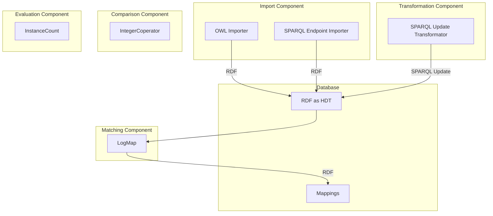

```mermaid
graph TD

    subgraph Database
    	RDF[RDF as HDT]
        Mappings
	end

    subgraph Import Component
    	OWL[OWL Importer]
        SparqlImporter[SPARQL Endpoint Importer]
	end
    subgraph Transformation Component
    	SparqlTransformator[SPARQL Update Transformator]
	end
    subgraph Matching Component
    	LogMap
	end
    subgraph Comparison Component
    	IntegerCoperator
	end
    subgraph Evaluation Component
    	InstanceCount
	end

    OWL -->|RDF| RDF
    SparqlImporter -->|RDF| RDF
    SparqlTransformator -->|SPARQL Update| RDF
    LogMap -->|RDF| Mappings
    
    RDF --> LogMap
```